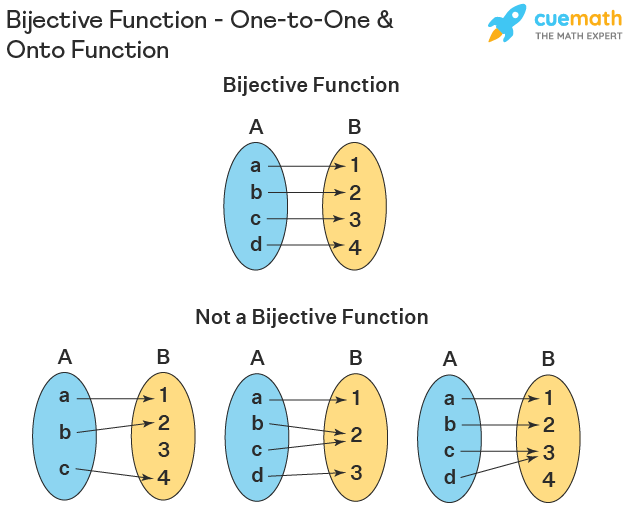

# [Day 1 - Word Pattern](https://leetcode.com/problems/word-pattern/description/)

Given a `pattern` and a string `s`, find if `s` follows the same pattern.

Here **follow** means a full match, such that there is a **bijection** between a letter in `pattern` and a non-empty word in `s`.

Example 1:

```
Input: pattern = "abba", s = "dog cat cat dog"
Output: true
```

Example 2:

```
Input: pattern = "abba", s = "dog cat cat fish"
Output: false
```

Example 3:

```
Input: pattern = "aaaa", s = "dog cat cat dog"
Output: false
```

Constraints:

* `1 <= pattern.length <= 300`
* `pattern` contains only lower-case English letters.
* `1 <= s.length <= 3000`
* `s` contains only lowercase English letters and spaces `' '`.
* `s` does not contain any leading or trailing spaces.
* All the words in `s` are separated by a single space.


#### 1. What is bijection ?

According to [wikipedia](https://en.wikipedia.org/wiki/Bijection), a bijection function is a function between the elements of two sets, where each element of one set is paired with exactly one element of the other set, and each element of the other set is paired with exactly one element of the first set. There are no unpaired elements. The following image illustrates that concept.



so, we have `pattern` that contains the elements of the first set and `s` where the words are the elements of the second set. We need to check:
* that each element from `pattern` is associated with a word from `s`.
* We can't have 2 `pattern` keys associated with the same word.
* We can't have the same `pattern` key associate with 2 words from `s`.

### 2. Splitting the words of `s`
Unlike Python `str.split()`, C++ doesn't have a method for splitting an `std::string` with a delimeter. There are different ways to mimick this behavior e.g., with the usage of [`strtok`](https://stackoverflow.com/questions/289347/using-strtok-with-a-stdstring), [boost Tokenizer](https://stackoverflow.com/a/55680), and `find` and `substring` method from `std::string`. The following is a usage of the latter one

```cpp
std::vector<std::string> string_split(const std::string& prompt, char delimeter)
{
	std::vector<std::string> splitted;
	std::string::size_type start = 0, end = 0;
	end = prompt.find(delimeter, end);
	while (end != std::string::npos)
	{
		std::string substring(prompt.substr(start, end - start));
		splitted.push_back(substring);
		end++;
		start = end;
		end = prompt.find(delimeter, end);
	}
	std::string substring(prompt.substr(start, end - start));
	splitted.push_back(substring);
	return splitted;
}
```
this above also works for string delimeters e.g., `"Then>:Now>:Forever"`.

for problem solving, we can use `istringstream` with space separated words.


```cpp
std::istringstream ss(s);
std::string current_word;
while (true)
{
        ss >> current_word;
        // current_word will be NULL if no more tokens can be extracted
}
```

additional option is `std::get_line` with `istringstream` for different **char** delimeters.

```cpp
// inputs
std::string str("abc:def");
char split_char = ':';

// work
std::istringstream split(str);
std::vector<std::string> tokens;
for (std::string each; std::getline(split, each, split_char); tokens.push_back(each));
```

### 3. Bijection Conditions
We can check the three conditions of bijection functions using different methods e.g., create two maps where the first one maps each pattern key to a word and the other maps each word to a pattern key.

* If we found that when accessing key, a different word has been associated, return `false`.
* If we found that the word has been associated already with a different pattern key, return `false`.
* If the number of words and pattern keys aren't equal, return `false`.
* Else, return `true`.

### Solution

```cpp
class Solution
{
public:
        bool wordPattern(std::string pattern, std::string s)
        {
                size_t pattern_keys_count = pattern.size();

                // used to extract each word
                std::istringstream ss(s);
                std::string current_word;

                // used to associate patterns to words and vice-versa
                std::unordered_map<char, std::string> pattern_word_map;
                std::unordered_map<std::string, char> word_pattern_map;

                // iterate on all pattern chars (keys)
                for (size_t index = 0; index < pattern_keys_count; ++index)
                {
                        // if there is no next word (i.e., the pattern characters are more than the words), return false
                        if (!(ss >> current_word)) // if there is no next word, ss >> current_word is NULL
                                return false;

                        char current_pattern_key = pattern[index];
                        auto pattern_it = pattern_word_map.find(current_pattern_key);
                        if (pattern_it == pattern_word_map.end())
                        {
                                // the current pattern key hasn't been associated with a word yet

                                // first, check if the current word itself has been assoicated with another pattern key
                                auto word_it = word_pattern_map.find(current_word);
                                if (word_it != word_pattern_map.end())
                                {
                                        // the current word is already associated with a key
                                        // (we know it is different from the current pattern key)
                                        // so return false
                                        return false;
                                }

                                // else, the word hasn't been associated with a different key.
                                // So, assoicate this word to that key and mark the word as visited
                                pattern_word_map[current_pattern_key] = current_word;
                                word_pattern_map[current_word] = current_pattern_key;
                        }
                        else
                        {
                                // the current key has a word associated with it, we need to check if that word is the same as the current word
                                if (pattern_it->second.compare(current_word) != 0)
                                {
                                        // both word are different
                                        return false;
                                }
                        }
                }

                // if we finished iterating on all keys and there's still words hasn't been processed, then return false
                if (ss >> current_word)
                        return false;
                
                // all good ? return true
                return true;
        }
};
```